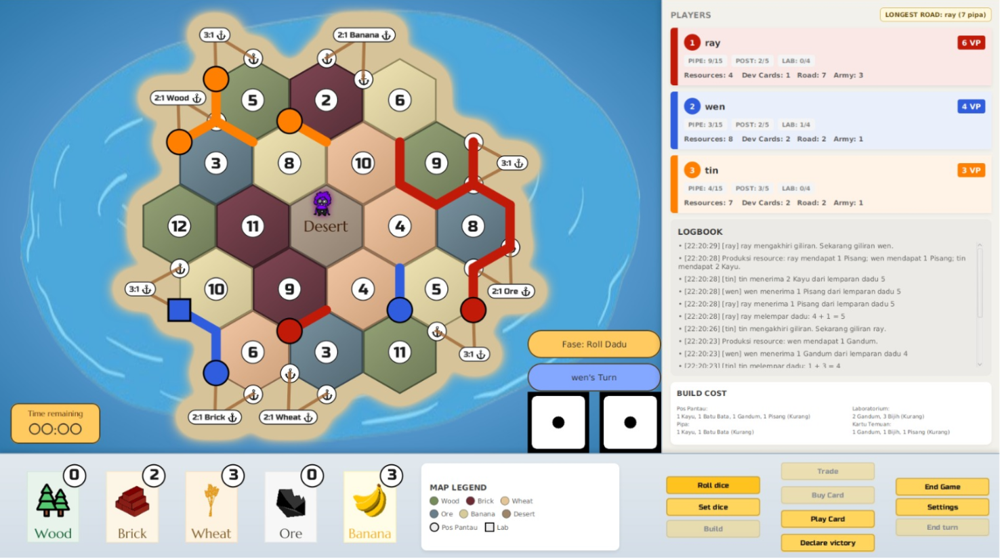

# Banana Republic - Tugas Besar 2 IF2010 OOP 2526


## Overview

Banana Republic is a board-based strategy game implemented as a desktop application using Java and JavaFX. The game adapts classic settlers mechanics into an experimental setting (a banana republic) where players compete to build Watchtowers and Laboratories to accumulate victory points. Each player collects five types of resources (Wood, Brick, Wheat, Ore, and Banana) produced by hexagonal tiles according to the result of two dice rolls.

The application supports three to four players, both human and bot, with a turn system featuring a 90-second timer per phase. Game features include: domestic and maritime resource trading, road construction, discovery card usage, JSON-based save/load system, and a plugin architecture that allows dynamic map generator replacement and bot strategy injection.

## Development Team (Group NUL - nullptr)

| NIM | Name |
|-----|------|
| 13524031 | Vincent Rionarlie |
| 13524033 | Ray Owen Martin |
| 13524037 | Nicholas Wise Saragih Sumbayak |
| 13524061 | Muhammad Aufar Rizqi Kusuma |
| 13524065 | Kurt Mikhael Purba |

## Dependencies & Prerequisites

- **Java Development Kit (JDK) 21** (LTS)
- **Apache Maven 3.9+**
- **JavaFX 21.0.2** (managed via Maven: controls, fxml, graphics, base)
- **Google Gson 2.11.0** (JSON save/load, managed via Maven)
- **JLayer 1.0.1** (pure Java MP3 playback, managed via Maven)
- **JUnit 5, AssertJ, TestFX** (headless GUI testing, managed via Maven)

> No manual SDK or library downloads are required — everything is managed via Maven dependencies.

## How to Run

### Compile
```bash
mvn clean compile
```

### Run Tests
```bash
mvn test
```
*(Tests run in headless mode suitable for CI/autograder using TestFX + Monocle)*

### Run Application (Development)
```bash
mvn javafx:run
```

### Build & Package
```bash
mvn clean package
```

This creates:
- `target/if2010-oop2526-tubes2-1.0-SNAPSHOT.jar` — standard JAR (manifest set)
- `target/if2010-oop2526-tubes2-1.0-SNAPSHOT-shaded.jar` — uber JAR with all dependencies
- `target/lib/` — individual dependency JARs

### Run Packaged JAR

**Recommended (using module path, no warnings):**
```bash
java --module-path target/lib --add-modules javafx.controls,javafx.fxml,javafx.graphics \
  -cp "target/if2010-oop2526-tubes2-1.0-SNAPSHOT.jar:target/lib/*" banana.republic.Main
```

**Simple (shaded JAR — may show a non-fatal module warning):**
```bash
java -jar target/if2010-oop2526-tubes2-1.0-SNAPSHOT-shaded.jar
```

### Makefile Targets

```bash
make build    # mvn clean package
make test     # mvn test
make run      # mvn javafx:run
make run-jar  # build + run the shaded JAR
make verify   # mvn clean verify
make clean    # mvn clean
```